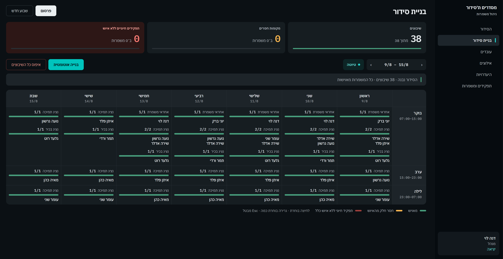
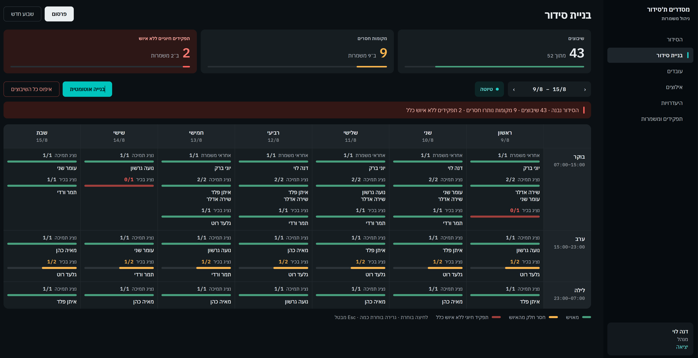
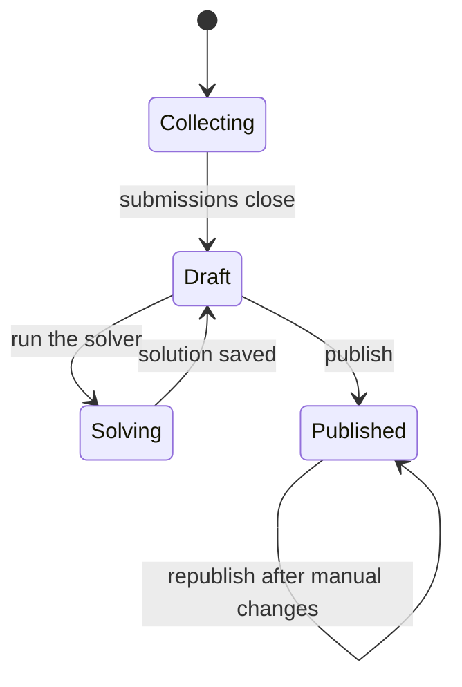

# Shift Scheduler

Weekly rostering for workplaces that run on shifts. Employees say when they
cannot work, an optimization engine builds the week, and the manager fills in
whatever it could not close.




A final year project.
The interface is in Hebrew and reads right to left.

## What it does

- **Set up your own shifts.** Shift types, job positions and how many people
  each shift needs are configured in the app, not fixed in the code.
- **Collect constraints.** Employees mark the shifts they cannot or would
  rather not work, until the submission window closes.
- **Solve the week.** Timefold searches for the best roster against fourteen
  constraints, and separates rules it must never break from ones it should only
  avoid, so a week that cannot be staffed perfectly still comes back as the best
  available answer.
- **Fill the rest by hand.** Gaps are shown per shift. Manual assignments are
  checked against the same rules, and the manager can override some of them
  knowingly.
- **Publish and notify.** Publishing emails everyone. Changes made afterwards
  email only the people they affect.

Not every week can be staffed. When the numbers do not work out, the solver
fills what it can and the screen says exactly what is left — amber where a
position is short, red where an essential one has nobody at all.



## Running it

Needs **Docker** and **JDK 21**. Maven and Node are downloaded by the build.

```bash
docker compose up -d                                    # MySQL, Artemis, MailHog
./mvnw package -DskipTests                              # builds the client too
java -jar target/shift-scheduler-0.0.1-SNAPSHOT.jar
```

On macOS or Linux, if the project arrived as a zip rather than a clone, run
`chmod +x mvnw` first, since a zip does not keep the execute bit.

Then open **<http://localhost:8080>**. Flyway creates the schema and loads the
demo data on first start.

| | |
|---|---|
| Manager | `dana@shiftscheduler.local` · `password123` |
| Employee | `yoni@shiftscheduler.local` · `password123` |

Every seeded account uses the same password. Mail is caught by MailHog at
<http://localhost:8025> and never leaves the machine.

**The demo data** is ten employees, three job positions, three shifts a day and
three weeks covering the whole cycle — one published, one in draft, one open for
constraints. `docker compose down -v && docker compose up -d` puts it back.
Flyway only runs at startup, so restart the app afterwards.

## How a week works

Every week moves through the same states, and what you are allowed to do depends
on where it is.



| | |
|---|---|
| **Collecting** | Employees submit constraints. The manager sets staffing levels. |
| **Draft** | Submissions are closed. The solver can run, and the manager can assign people by hand. |
| **Solving** | The solver is working. The week is frozen, along with leave, positions, shift types, and each employee's position and hours. |
| **Published** | The roster is out and everyone has been emailed. |

A published week is never rolled back, because it is the record of what people
were told. It can still be corrected: manual changes take effect immediately,
and republishing emails just the people those changes affected.

## Built with

| | |
|---|---|
| Java 21, [Spring Boot](https://spring.io/projects/spring-boot) 4.1 | REST API, controller / service / repository |
| [Spring Data JPA](https://spring.io/projects/spring-data-jpa), Hibernate | 10 entities, optimistic locking on the aggregate roots |
| MySQL 8.4, [Flyway](https://www.red-gate.com/products/flyway/) | Schema and demo data as versioned migrations |
| [Timefold Solver](https://timefold.ai) 2.4 | The optimisation engine. Constraint streams, hard / medium / soft |
| [Apache Artemis](https://activemq.apache.org/components/artemis/) (JMS) | Publishing hands off to a queue, so the request returns at once |
| [Spring Security](https://spring.io/projects/spring-security) | JWT in an HttpOnly cookie, Argon2, role checks |
| [React](https://react.dev) 19, [Vite](https://vite.dev) | Single page app, plain JSX, hand written CSS |
| [MailHog](https://github.com/mailhog/MailHog) | Catches outgoing mail in development |

The solving is done by [Timefold](https://timefold.ai), an open source
constraint solver (Apache-2.0). This project supplies the model and the rules —
`solver/SolverRules.java` is where the fourteen constraints are defined —
and Timefold does the search.

## Tests

```bash
docker compose up -d     # the context test starts the app, so it needs the database
./mvnw test
```

| | |
|---|---|
| `SolverRulesTest` | The fourteen solver constraints, 36 cases. Timefold's constraint verifier runs one constraint at a time and asserts the penalty it produces, so a rule is checked without solving a whole week. |
| `ManualRulesTest` | The rules a manual assignment is checked against, 15 cases. |
| `RuleConstantsTest` | The arithmetic both of them read, 11 cases — rest between two shifts in either order, and the minimum once leave is taken off. |
| `EmployeeMailerTest` | Who gets a mail and what happens when one address is refused, 4 cases. |

The solver and manual assignment hold the same rules separately, so the first
two files are what keeps them agreeing on what is allowed.

The API is checked by hand. `http/` holds the request files, and every request
carries the status code it expects.

| | |
|---|---|
| `api-checks` | 151 requests — every endpoint at least once, and a week taken from collecting to published. |
| `week-creation` | 19 requests for copying a week and what carries over. |
| `solver-with-constraints` | 20 requests for leave, stated constraints and a pinned assignment. |
| `solver-under-pressure` | 24 requests for too few people, and for a position nobody may cover. |
| `submission-deadline` | 8 requests for the window closing on its own. |

Each file exists twice, once for the IntelliJ HTTP Client and once for the VS
Code REST Client. The header says how to run it and which week it builds.

## Working on the code

The steps above pack the client into the jar, so every change to the React side
needs a full rebuild. While developing, run the two halves separately — Vite
reloads on save and forwards `/api` to the Java process:

```bash
./mvnw spring-boot:run
cd client && npm run dev
```

The app is then at <http://localhost:5173>. Same database, same API. The links
in the mails come from `app.url`, which points at port 8080. Set `APP_URL` to
change it.

## Layout

```
src/main/java/com/shiftscheduler/
  assignment/    manual assignment and the rules it checks
  auth/          login, JWT, current user
  domain/        the entities
  employee/      staff and their job positions
  leave/         holiday and sick days
  notification/  JMS listeners and the mailer
  position/      job positions
  preference/    the constraints employees submit
  repository/    Spring Data repositories
  schedule/      weeks, shifts, requirements, status transitions
  shifttype/     morning, evening, night
  solver/        Timefold model, constraints, loading and saving
  web/           error handling and the SPA route
client/src/
  api/           fetch wrapper
  auth/          auth context and route guards
  components/    grid, panels, dialogs
  pages/         one per screen
src/test/java/com/shiftscheduler/
  assignment/    the rules a manual assignment is checked against
  domain/        the arithmetic both rule sets read
  notification/  the mailer
  solver/        the solver constraints
http/
  intellij/      request files for the IntelliJ HTTP Client
  vscode/        the same files for the VS Code REST Client
```

## Known limitations

Login is not rate limited. Every attempt costs an Argon2 hash, so a flood of
attempts is the simplest way to load the server. A production deployment would
put a limiter in front of `/api/auth/login`.

## License

MIT — see [LICENSE](LICENSE).
